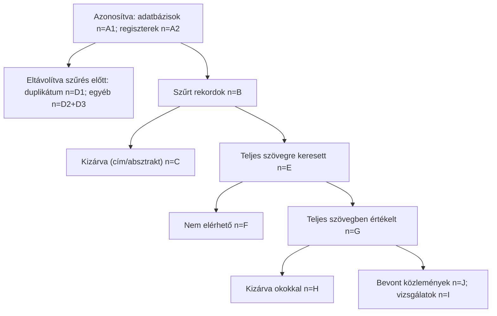

# PRISMA 2020 folyamatábra — számok és ellenőrzés

> Ha a `composer` plugin telepítve van, annak `prisma` parancsa ugyanezeket a számokat vezeti (`prisma-flow.json`) és
> figure-forge folyamatábra-specifikációt ad; ez a sablon akkor csak ellenőrzésre kell.

| Lépés | Szám | Ellenőrzés |
|---|---|---|
| Azonosított rekordok — adatbázisok (n = A1) | | adatbázisonként a keresési naplóból |
| Azonosított rekordok — regiszterek (n = A2) | | |
| Szűrés előtt eltávolítva: duplikátumok (D1), automatikusan kizárt (D2), egyéb (D3) | | |
| Szűrt rekordok (n = B) | | B = A1 + A2 − D1 − D2 − D3 |
| Kizárt rekordok (cím/absztrakt) (n = C) | | |
| Teljes szövegre keresett (n = E) | | E = B − C |
| Nem elérhető teljes szöveg (n = F) | | |
| Teljes szövegben értékelt (n = G) | | G = E − F |
| Kizárt teljes szöveg okokkal (n = H = H1 + H2 + …) | | okonként felsorolva |
| Bevont közlemények (n = J) és vizsgálatok (n = I) | | J = G − H (+ egyéb forrásból bevont közlemények); I ≤ J — a vizsgálatokat külön számold (egy vizsgálatnak több közleménye lehet) |
| Ebből metaanalízisben (kimenetenként) | | |
| Egyéb forrásból (hivatkozás-követés, szakértő) — külön ág | | |

